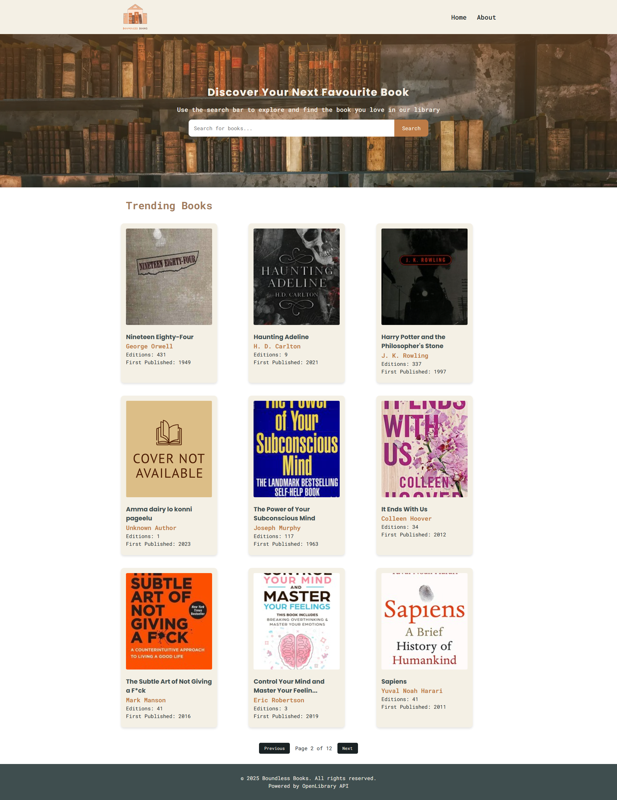

# Boundless Books Library App

[](https://reactjs.org/)
[](https://vercel.com)
[](https://openlibrary.org/developers/api)

A modern web application for browsing and searching books using the OpenLibrary API. Features include book search by title, trending books display, and detailed book information.



## Features

- 🔍 Search books by title
- 📚 Display trending books
- 🖼️ Book cover images with lazy loading
- 📖 Detailed book information page
- 💅 Modern UI with SCSS styling
- 📱 Responsive design

## Technologies

- **Frontend**: React 18
- **Routing**: React Router 6
- **Styling**: SCSS
- **API**: OpenLibrary
- **Deployment**: Vercel

## Deployment

Live Demo: https://boundless-books-app.vercel.app

## Installation

1. Clone the repository:
```bash
git clone https://github.com/ellabach294/boundless-books-library.git
cd book-library
```
2. Install dependencies:

```bash
npm install
```
3. Start the development server:
```bash
npm start
```

## Deployment
The application is deployed on Vercel. To deploy your own version:

1. Push your code to a GitHub repository.
2. Sign up on Vercel.
3. Import your repository.
4. Deploy with default settings.

Live Demo: https://boundless-books-library.vercel.app

## Project Structure

```bash
boundless-books-library/
├── public/                  # Static assets
│   └── index.html          
├── src/                     # Source code
│   ├── components/          # Reusable components (Navbar, SearchBar, BookCard, etc.)
│   ├── img/                 # Default book cover image
│   ├── pages/               # Application pages (Home, SearchResults, BookDetails, About)
│   ├── styles/              # SCSS styles and mixins
│   ├── utils/               # Utility functions
│   ├── index.js             # Main application component
│   └── index.scss           # Styles Resets
├── .gitignore               # Files to ignore in Git
├── package.json             # Project dependencies and scripts
└── README.md                # Project documentation
```

## Contributing
Contributions are welcome! Please follow these steps:

1. Fork the project.
2. Create your feature branch:
```bash
git checkout -b feature/AmazingFeature
```
3. Commit your changes
```bash
git commit -m 'Add some AmazingFeature'
```
4. Push to the branch
```bash
git push origin feature/AmazingFeature
```
5. Open a Pull Request

## License
This project is licensed under the MIT License. See the LICENSE file for details.

## Acknowledgments
* OpenLibrary for their free and open book API.
* React for the amazing frontend library.
* Vercel for seamless deployment.

Enjoy exploring books with the Boundless Books Library App! 📚✨

